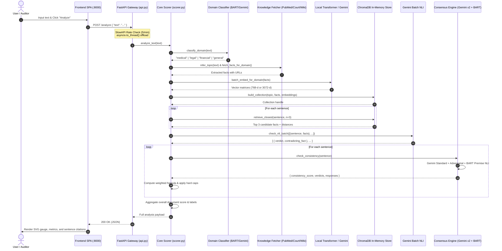

# 🕵️‍♂️ Hallucination Detector 2.0 — Domain-Aware AI Fact-Checking Engine

An end-to-end, domain-aware hallucination detection and factual verification platform for Large Language Model outputs. The system ingests arbitrary LLM-generated assertions, classifies domain context (**Medical**, **Legal**, **Financial**, or **General**), dynamically routes claims to authoritative domain-specific knowledge bases (**PubMed**, **CourtListener**, or **Wikipedia**), indexes verified facts using domain-specialized transformer embeddings in an in-memory **ChromaDB** vector store, evaluates claims across four orthogonal signals (**NLI**, **Multi-Model Consensus**, **Vector Grounding**, and **Embedding Similarity**), and delivers an interactive, dark-mode analytical interface with source attribution and clickable citations.

---

## Table of Contents
1. [Architecture Overview](#1-architecture-overview)
2. [End-to-End Request Trace](#2-end-to-end-request-trace)
3. [Domain Classification & Knowledge Routing Pipeline](#3-domain-classification--knowledge-routing-pipeline)
4. [Multi-Signal Scoring Engine & Mathematical Formulations](#4-multi-signal-scoring-engine--mathematical-formulations)
5. [Domain Embeddings & Multi-Model Consensus Engine](#5-domain-embeddings--multi-model-consensus-engine)
6. [Frontend UI Architecture & Data Contract](#6-frontend-ui-architecture--data-contract)
7. [System Data Flow Architecture](#7-system-data-flow-architecture)
8. [Known Limitations & Edge Cases](#8-known-limitations--edge-cases)
9. [Installation & Run Guide](#9-installation--run-guide)

---

## 1. Architecture Overview

```
 ┌────────────────────────────────────────────────────────────────────────┐
 │                      VANILLA SPA FRONTEND (HTML5/CSS3/JS)              │
 │  • Real-time SVG Radial Gauge & Verdict Bar (0.00 to 1.00)             │
 │  • 4-Metric Breakdown: NLI (40%), Consistency (35%), Grounding (15%),  │
 │    Embedding Similarity (10%)                                          │
 │  • Expandable Sentence Cards with Direct Links (PubMed, CourtListener) │
 └───────────────────────────────────┬────────────────────────────────────┘
                                     │ HTTP (POST /analyze)
                                     ▼
 ┌────────────────────────────────────────────────────────────────────────┐
 │                        FASTAPI BACKEND (:8000)                         │
 │                                                                        │
 │  ┌──────────────────────────────────────────────────────────────────┐  │
 │  │ 1. API GATEWAY & RUNTIME SCHEDULER (api.py)                      │  │
 │  │  • SlowAPI rate limiter (5 req/min per IP, 429 handler)          │  │
 │  │  • Text sanitization & 2,000-character input bounds              │  │
 │  │  • Non-blocking async offload (`asyncio.to_thread(analyze_text)`)│  │
 │  │  • Static asset mount (`/frontend`) & `/health` monitoring        │  │
 │  └──────────────────────────────────┬───────────────────────────────┘  │
 │                                     ▼                                  │
 │  ┌──────────────────────────────────────────────────────────────────┐  │
 │  │ 2. DOMAIN ROUTING & SPECIALIZED INGESTION (core/)                │  │
 │  │  • Domain Classifier (`domain_classifier.py`): BART-MNLI zero-   │  │
 │  │    shot + keyword vocabulary verification + Gemini fallback      │  │
 │  │  • Topic Inference (`fetcher.py`): Gemini exact entity extraction │  │
 │  │  • Medical Ingestion (`pubmed_source.py`): NCBI E-Utilities      │  │
 │  │  • Legal Ingestion (`legal_source.py`): CourtListener v4 API     │  │
 │  │  • General Ingestion (`wikipedia_source.py`): MediaWiki API      │  │
 │  └──────────────────────────────────┬───────────────────────────────┘  │
 │                                     ▼                                  │
 │  ┌──────────────────────────────────────────────────────────────────┐  │
 │  │ 3. DOMAIN EMBEDDINGS & VECTOR STORE                              │  │
 │  │  • Local HuggingFace Models on Apple Silicon MPS / CUDA / CPU:   │  │
 │  │    - Medical: `NeuML/pubmedbert-base-embeddings` (768-d)         │  │
 │  │    - Legal: `law-ai/InLegalBert` (768-d)                         │  │
 │  │    - Financial: `ProsusAI/finbert` (768-d)                       │  │
 │  │    - General: Google Gemini `gemini-embedding-001` (3072-d batch)│  │
 │  │  • ChromaDB In-Memory Store (`vector_store.py`): HNSW cosine     │  │
 │  │    distance, domain-prefixed collection isolation                │  │
 │  └──────────────────────────────────┬───────────────────────────────┘  │
 │                                     ▼                                  │
 │  ┌──────────────────────────────────────────────────────────────────┐  │
 │  │ 4. ORTHOGONAL 4-SIGNAL SCORING ENGINE (core/scorer.py)           │  │
 │  │  • Signal 1: Batch NLI (`nli.py`) via Gemini (ENTAILMENT,        │  │
 │  │    CONTRADICTION, NEUTRAL) with 4-tier exponential backoff       │  │
 │  │  • Signal 2: Multi-Model Consensus (`consistency.py`):           │  │
 │  │    Gemini Standard (40%) + Adversarial (25%) + BART-MNLI (35%)   │  │
 │  │  • Signal 3: Vector Grounding $1 / (1 + d_{cosine})$             │  │
 │  │  • Signal 4: Normalized Cosine Embedding Similarity              │  │
 │  │  • Hard Cap Overrides: Contradiction ($\le 0.25$), False ($\le 0.30$)│
 │  │  • Sentence aggregator & mixed-hallucination classifier          │  │
 │  └──────────────────────────────────────────────────────────────────┘  │
 └────────────────────────────────────────────────────────────────────────┘
```

---

## 2. End-to-End Request Trace

When a user submits text via the Web UI or directly via `POST /analyze`, the system executes sequentially across modular layers:

1. **`api.py` (`POST /analyze`)**:
   - Inspects client IP address via `slowapi` (`@limiter.limit("5/minute")`).
   - Validates character length ($0 < \text{len} \le 2000$).
   - Dispatches `analyze_text(text)` into a dedicated background worker thread pool via `asyncio.to_thread()` to prevent blocking the Uvicorn event loop during 30–90s model inferences.
2. **`core/domain_classifier.py` (`classify_domain`)**:
   - Dispatches zero-shot candidate hypothesis classification (`medical`, `legal`, `financial`, `general`) to HuggingFace BART-MNLI (`facebook/bart-large-mnli`).
   - Evaluates confidence thresholds ($\text{top\_score} \ge 0.40$, score gap $\ge 0.15$).
   - Performs domain keyword sanity checking against `DOMAIN_KEYWORDS` to prevent named-entity false positives (e.g., "Satya Nadella" triggering financial).
   - Automatically falls back to deterministic zero-temperature Gemini prompt if HuggingFace is cold-starting or unreachable.
3. **`core/fetcher.py` (`infer_topic`)**:
   - Invokes Gemini with structured constraints to extract the exact primary entity article title (e.g., `"Albert Einstein"`, `"Amoxicillin"`, `"Fourth Amendment to the United States Constitution"`).
4. **`core/sources/__init__.py` (`fetch_facts_for_domain`)**:
   - **Medical**: Calls NCBI PubMed E-Utilities (`pubmed_source.py`), executing `esearch` for PMIDs followed by `efetch` for abstract text. Attaches citable URLs (`https://pubmed.ncbi.nlm.nih.gov/<pmid>/`).
   - **Legal**: Calls CourtListener v4 REST API (`legal_source.py`) with `type=o` (opinions), filtering out procedural metadata, case numbers, and docket headers. Attaches direct opinion links.
   - **Financial / General**: Queries MediaWiki API (`wikipedia_source.py`) via a 3-tier fallback strategy (Exact Match $\rightarrow$ Topic Search $\rightarrow$ Keyword Search).
   - **Universal Resilience**: Any empty domain result automatically falls back to Wikipedia facts to prevent pipeline starvation.
5. **`core/domain_embedder.py` (`get_embed_fn`, `batch_embed_for_domain`)**:
   - Binds the active domain callable. Loads domain-specific BERT models (`AutoModel.from_pretrained`) onto the optimal available accelerator (`mps` on Apple Silicon, `cuda` on NVIDIA, or `cpu`).
   - Generates vector representations in a single batched tensor forward pass with mean pooling over `last_hidden_state`.
   - General domain routes to Gemini's `models/gemini-embedding-001` batch API in a single HTTP payload.
6. **`core/vector_store.py` (`build_collection`)**:
   - Initializes an in-memory `chromadb.Client()` collection namespaced as `facts_{domain}_{topic}` with HNSW cosine distance (`hnsw:space: cosine`).
   - Stores documents, vector embeddings, and citation metadata (`source`, `url`).
7. **`core/scorer.py` (`split_sentences`, sentence loop)**:
   - Splits input into discrete claim sentences via regex lookbehind `(?<=[.!?]) +` (filtering clauses $\le 20$ chars).
   - Queries ChromaDB for the top-$3$ nearest neighbor facts for each sentence.
8. **`core/nli.py` (`check_nli_batch`)**:
   - Evaluates all `(claim, top_facts)` tuples in a single batched JSON prompt to Gemini.
   - Assigns logical labels (`ENTAILMENT`, `NEUTRAL`, `CONTRADICTION`).
   - Retries invalid JSON formatting and falls back to individual evaluations with exponential backoff on HTTP 429 quota limits.
9. **`core/consistency.py` (`check_consistency`)**:
   - Executes multi-model consensus voting across Gemini Standard ($40\%$), Gemini Adversarial ($25\%$), and BART-MNLI ($35\%$) via premise-grounded NLI.
10. **`core/scorer.py` (`score_sentence`, aggregation)**:
    - Combines NLI ($40\%$), Self-Consistency ($35\%$), Grounding ($15\%$), and Embedding Similarity ($10\%$).
    - Applies hard caps: Contradiction verdict forces score $\le 0.25$; All-False consensus forces score $\le 0.30$.
    - Classifies sentence as `hallucinated` if $\text{score} < 0.45$.
    - Determines overall document verdict: `mostly grounded`, `mixed — k/n sentence(s) hallucinated`, or `likely hallucinated`.
11. **FastAPI Response**:
    - Returns structured JSON payload to the frontend.

---

## 3. Domain Classification & Knowledge Routing Pipeline

### 3.1 Domain Decision Matrix & Models

| Domain | Classifier Primary | Sanity Keywords Sample | Primary Fact Source | Source Fallback | Domain Embedding Model | Dimensions |
| :--- | :--- | :--- | :--- | :--- | :--- | :---: |
| **Medical** | BART-MNLI (HF) | `patient`, `drug`, `infection`, `antibiotic`, `dose`, `clinical` | NCBI PubMed E-Utilities | Wikipedia | `NeuML/pubmedbert-base-embeddings` | 768 |
| **Legal** | BART-MNLI (HF) | `court`, `defendant`, `statute`, `amendment`, `ruling`, `appeal` | CourtListener v4 Opinions API | Wikipedia | `law-ai/InLegalBert` | 768 |
| **Financial** | BART-MNLI (HF) | `stock`, `revenue`, `ebitda`, `inflation`, `ipo`, `shares` | Wikipedia (Business/Market) | Wikipedia | `ProsusAI/finbert` | 768 |
| **General** | Default Fallback | Universal / Unclassified vocabulary | MediaWiki API (`en.wikipedia.org`) | None | Google `gemini-embedding-001` | 3072 |

### 3.2 Anti-Misclassification Architecture
Zero-shot NLI models frequently misclassify claims that mention famous entities associated with a specific field (e.g., "Satya Nadella won the Nobel Prize" erroneously classified as *Financial*; "Albert Einstein" classified as *Legal*). 

`core/domain_classifier.py` enforces a 3-stage validation barrier:
1. **Score Gap Gate**: The top predicted domain score must exceed the runner-up score by $\Delta \ge 0.15$.
2. **Absolute Confidence Floor**: The classification probability must meet $P(\text{domain}) \ge 0.40$.
3. **Lexical Keyword Verification**: If the probability is below $0.65$, the text **must** contain at least one curated domain-specific keyword from `DOMAIN_KEYWORDS`. If missing, the classification is overridden to `general`.
4. **Gemini Fallback**: If the HuggingFace router returns HTTP 503 (cold start) or times out, Gemini zero-temperature generation acts as an immediate failover.

### 3.3 Domain Fact Ingestion Mechanics

#### PubMed E-Utilities (`core/sources/pubmed_source.py`)
- Executes a two-step REST pipeline against `eutils.ncbi.nlm.nih.gov`:
  1. `esearch.fcgi`: Queries the PubMed database for the inferred entity topic, retrieving the top 3 relevant PMIDs.
  2. `efetch.fcgi`: Retrieves raw XML/text abstracts for the PMIDs in a single request.
- Splits abstracts into clean sentences ($>40$ chars), stripping PMID and Author headers, and attaches direct permalinks: `https://pubmed.ncbi.nlm.nih.gov/<pmid>/`.

#### CourtListener Opinions (`core/sources/legal_source.py`)
- Queries `www.courtlistener.com/api/rest/v4/search/` with `type=o` to target published court opinions.
- **Procedural Noise Filter (`_is_procedural`)**: Strips docket numbers (e.g., `21-cv-01234`), filing timestamps (`Filed: January 5, 2022`), court headers (`DISTRICT COURT OF...`), and standalone case citations (`Miranda v. Arizona, 384 U.S. 436`), preserving only substantive judicial reasoning.

#### MediaWiki 3-Tier Fallback (`core/fetcher.py`)
1. **Tier 1 (Exact Title)**: Direct lookup via `wikipediaapi.Wikipedia`.
2. **Tier 2 (MediaWiki Search API)**: Full topic text query against `https://en.wikipedia.org/w/api.php` (`action=query&list=search`), examining the top 5 article summaries.
3. **Tier 3 (Significant Stem Search)**: Decomposes multi-word topics into significant semantic roots (words $>3$ characters) to locate parent articles (e.g., resolving `"GitHub acquisition"` to `"GitHub"`).

---

## 4. Multi-Signal Scoring Engine & Mathematical Formulations

To prevent model blind spots, each sentence claim is scored across four independent, mathematically distinct dimensions:

```
┌────────────────────────────────────────────────────────────────────────┐
│                        4-SIGNAL SCORING EQUATION                       │
│                                                                        │
│   Final Score = 0.40 · S_NLI + 0.35 · S_Cons + 0.15 · S_Gnd + 0.10 · S_Emb   │
│                                                                        │
│   Classification Threshold:                                            │
│     Final Score < 0.45 ──► HALLUCINATED                                │
│     Final Score ≥ 0.45 ──► GROUNDED                                    │
│                                                                        │
│   Hard Cap Overrides:                                                  │
│     IF NLI Verdict == 'CONTRADICTION' ──► Final Score = min(Score, 0.25)│
│     IF All Consensus Models == 'FALSE' ─► Final Score = min(Score, 0.30)│
└────────────────────────────────────────────────────────────────────────┘
```

### 4.1 Signal 1: Natural Language Inference ($S_{\text{NLI}}$, Weight: $40\%$)
NLI reads the explicit semantic logic between the claim (hypothesis) and the top-3 ChromaDB facts (premises).
- **Entailment**: The source fact directly validates the claim $\implies S_{\text{NLI}} = 1.0$.
- **Neutral**: The source fact is tangential or does not explicitly address the specific assertion $\implies S_{\text{NLI}} = 0.5$.
- **Contradiction**: The source fact directly refutes the claim $\implies S_{\text{NLI}} = 0.0$.
- **Priority Hierarchy**:
  $$\text{Verdict} = \begin{cases} 
  \text{CONTRADICTION} & \text{if } \exists \text{ label} = \text{CONTRADICTION} \\
  \text{ENTAILMENT} & \text{else if } \exists \text{ label} = \text{ENTAILMENT} \\
  \text{NEUTRAL} & \text{otherwise}
  \end{cases}$$

### 4.2 Signal 2: Multi-Model Consensus ($S_{\text{Cons}}$, Weight: $35\%$)
Independent model consensus eliminates confirmation bias by probing the claim across distinct architectures and prompt paradigms:
- **Gemini Standard** ($w_1 = 0.40$): Factual assessment (`TRUE`, `UNCERTAIN`, `FALSE`).
- **Gemini Adversarial** ($w_2 = 0.25$): Devil's advocate prompt actively seeking counter-evidence, misnomers, and false premises.
- **BART-MNLI Premise NLI** ($w_3 = 0.35$): Generates an authoritative ground-truth premise via Gemini, then uses BART zero-shot classification to test if the claim is `supported` vs `refuted`.
- **Mathematical Formula**:
  $$S_{\text{Cons}} = \sum_{i=1}^{M} w_i \cdot C_i, \quad \text{where } C_i \in \{1.0 \text{ (TRUE)}, 0.5 \text{ (UNCERTAIN)}, 0.0 \text{ (FALSE)}, P(\text{supported})\}$$
- If BART-MNLI is unreachable, weights gracefully rebalance to Gemini Standard ($0.55$) and Adversarial ($0.45$).

### 4.3 Signal 3: Vector Grounding ($S_{\text{Gnd}}$, Weight: $15\%$)
Measures the topological proximity between the claim and the closest retrieved fact in the domain vector space:
$$S_{\text{Gnd}} = \frac{1}{1 + d_{\text{Chroma}}}$$
Where $d_{\text{Chroma}}$ is the HNSW cosine distance ($d = 1 - \cos(\theta)$). As distance approaches $0$ (identical vectors), $S_{\text{Gnd}} \to 1.0$.

### 4.4 Signal 4: Cosine Embedding Similarity ($S_{\text{Emb}}$, Weight: $10\%$)
Computes the direct angle between the claim vector $\vec{u}$ and the top fact vector $\vec{v}$, normalized from $[-1, 1]$ to $[0, 1]$:
$$S_{\text{Emb}} = \frac{\cos(\vec{u}, \vec{v}) + 1}{2} = \frac{1}{2}\left(\frac{\vec{u} \cdot \vec{v}}{\|\vec{u}\|_2 \|\vec{v}\|_2} + 1\right)$$

### 4.5 Hard Cap Overrides
Statistical averaging can mask egregious factual errors (e.g., high embedding similarity to a general topic masking a critical factual contradiction). Hard caps prevent dilution:
1. **Contradiction Cap**: $\text{Verdict} = \text{CONTRADICTION} \implies \text{Final Score} \le 0.25$.
2. **Consensus Rejection Cap**: $\text{Count}(\text{FALSE}) = 3 \implies \text{Final Score} \le 0.30$.

---

## 5. Domain Embeddings & Multi-Model Consensus Engine

### 5.1 Local Transformer Models & Hardware Acceleration

```
┌────────────────────────────────────────────────────────────────────────┐
│                        Local Model Cache Pipeline                      │
│                                                                        │
│  AutoTokenizer + AutoModel.from_pretrained(model_id)                   │
│         │                                                              │
│         ▼                                                              │
│  Device Placement:                                                     │
│    • Apple Silicon: torch.backends.mps.is_available() ──► "mps"        │
│    • NVIDIA GPU:    torch.cuda.is_available()         ──► "cuda"       │
│    • Fallback:                                        ──► "cpu"        │
│         │                                                              │
│         ▼                                                              │
│  Forward Pass: last_hidden_state = model(**inputs).last_hidden_state   │
│         │                                                              │
│         ▼                                                              │
│  Mean Pooling: embedding = last_hidden_state.mean(dim=1).squeeze()     │
└────────────────────────────────────────────────────────────────────────┘
```

- **In-Memory Model Caching (`_MODEL_CACHE`)**: Tokenizers and PyTorch neural networks are loaded once into process memory on demand, caching ~440MB weights in `~/.cache/huggingface/hub/`.
- **Domain Specialization Advantage**: PubMedBERT understands biomedical distinctions (e.g., cell wall synthesis vs. cell membrane disruption) that off-the-shelf general embedding models conflate. InLegalBERT captures statutory phraseology and case law precedents.

### 5.2 BART-MNLI Premise-Grounded Verification Architecture
Traditional string concatenation (`inputs: {text, text_pair}`) causes HuggingFace Router failures. `core/consistency.py` uses a two-phase hypothesis-template architecture:
1. **Targeted Premise Synthesis**: Gemini synthesizes a single ground-truth fact statement naming the entity and verified details (e.g., *"Einstein won the 1921 Nobel Prize in Physics for his discovery of the law of the photoelectric effect, not relativity"*).
2. **Router-Compliant Zero-Shot NLI**:
   ```python
   payload = {
       "inputs": premise,  # String input satisfies router specification
       "parameters": {
           "candidate_labels": ["supported", "refuted"],
           "hypothesis_template": 'The claim that "{claim}" is {}.',
           "multi_label": False
       }
   }
   ```
   BART scores $P(\text{supported})$. If $P \ge 0.60 \implies \text{TRUE}$; if $P \le 0.40 \implies \text{FALSE}$; otherwise `UNCERTAIN`.

---

## 6. Frontend UI Architecture & Data Contract

The user interface (`frontend/index.html`, `style.css`, `script.js`) is an asynchronous, zero-dependency Single Page Application engineered for clarity and auditability.

```
┌────────────────────────────────────────────────────────────────────────┐
│                          FRONTEND INTERACTION FLOW                     │
│                                                                        │
│   User Enters Text ──► Client-side Domain Preview & Char Count         │
│         │                                                              │
│         ▼                                                              │
│   Click Analyze ────► Smooth Linear Progress Sequence:                 │
│                       [Classifying] ──► [Fetching] ──► [Embedding]     │
│                       ──► [NLI Batch] ──► [Consensus] ──► [Scoring]    │
│         │                                                              │
│         ▼                                                              │
│   JSON Render ──────► SVG Animated Radial Gauge (0.00 – 1.00)          │
│                       Overall Score Bar + Domain Tag + Metadata Badges │
│                       4-Card Metric Grid (NLI, Cons, Gnd, Emb)         │
│                       Accordion Sentence Cards with Live Source Links  │
└────────────────────────────────────────────────────────────────────────┘
```

### 6.1 JSON API Response Contract (`POST /analyze`)
```json
{
  "topic": "Albert Einstein",
  "domain": "general",
  "overall_score": 0.385,
  "overall_label": "mixed — 1/2 sentence(s) hallucinated",
  "sentence_count": 2,
  "hallucinated_count": 1,
  "grounded_count": 1,
  "results": [
    {
      "sentence": "Einstein won the Nobel Prize for the theory of relativity.",
      "final_score": 0.25,
      "label": "hallucinated",
      "grounding_score": 0.7241,
      "consistency_score": 0.15,
      "embedding_score": 0.7812,
      "nli_score": 0.0,
      "nli_verdict": "CONTRADICTION",
      "evidence": "He received the 1921 Nobel Prize in Physics for his services to theoretical physics, and especially for his discovery of the law of the photoelectric effect.",
      "evidence_source": "Wikipedia",
      "evidence_url": "https://en.wikipedia.org/wiki/Albert_Einstein",
      "evidence_distance": 0.381,
      "top_facts": [
        {
          "fact": "He received the 1921 Nobel Prize in Physics...",
          "distance": 0.381,
          "source": "Wikipedia",
          "url": "https://en.wikipedia.org/wiki/Albert_Einstein"
        }
      ],
      "contradicting_fact": "He received the 1921 Nobel Prize in Physics for his services to theoretical physics, and especially for his discovery of the law of the photoelectric effect.",
      "nli_labels": [["He received...", "CONTRADICTION"]],
      "consistency_responses": [
        "False. Einstein won the Nobel Prize for the photoelectric effect, not relativity.",
        "False. The Nobel Committee specifically cited the photoelectric effect."
      ],
      "consistency_verdicts": ["FALSE", "FALSE", "FALSE"]
    }
  ]
}
```

### 6.2 UI Visual Hierarchy
- **SVG Radial Gauge**: Dynamically colors score: `#00ff88` (Green, $\ge 0.65$), `#f0a030` (Amber, $0.40 - 0.64$), `#ff4060` (Red, $< 0.40$).
- **Color-Coded Source Badges**: Medical (`#5dcaa5`), Legal (`#afa9ec`), Financial (`#f0a030`), General (`#00ff88`).
- **Interactive Sentence Accordions**: Clicking a sentence card reveals metric breakdown cells, closest matching source facts, model consensus rationales, NLI verdict badges, and clickable external citation permalinks.
- **One-Click Clipboard Export**: Formats the entire verification report with per-sentence scores and citations into clean text.

---

## 7. System Data Flow Architecture



---

## 8. Known Limitations & Edge Cases

1. **Intra-Sentence Compound Assertions**: The sentence splitter divides text by sentence-terminating punctuation. If a sentence contains two independent clauses where one is true and one is false (*"Einstein was born in Germany and won the Nobel Prize for relativity"*), the truthful segment may raise the semantic embedding similarity, relying heavily on the NLI contradiction signal for suppression.
2. **Entity Obscurity & Absence of Coverage**: If an assertion addresses a completely obscure, unindexed entity that does not exist on Wikipedia, PubMed, or CourtListener, external knowledge grounding returns empty. The system falls back cleanly to the Multi-Model Consensus signal ($35\%$), which operates from intrinsic model knowledge.
3. **PubMed / CourtListener Search Heuristics**: E-Utilities and CourtListener search rely on entity search accuracy. If entity inference yields an overly verbose title, search query fallbacks are triggered to recover relevant documentation.
4. **Free-Tier LLM Rate Limits**: To prevent Google GenAI HTTP 429 quota exhaustion (`15 RPM` on free-tier preview models), `core/nli.py` enforces thread-safe rate-limiting locks and a 4-tier exponential backoff ($15\text{s} \to 30\text{s} \to 60\text{s} \to 120\text{s}$).

---

## 9. Installation & Run Guide

### 9.1 Prerequisites
- **Python**: Version `3.11.x` (`python3 --version`)
- **Virtual Environment Tool**: `venv` or `pyenv`
- **Git**: Installed and available on system path
- **Hardware**: Compatible with macOS (Apple Silicon MPS), Linux (CUDA), or CPU

---

### 9.2 Step-by-Step Installation

#### Step 1: Clone Repository & Create Virtual Environment
```bash
# Clone the repository
git clone https://github.com/aresoasis02/Hallucination-Detector-2.0.git
cd "Hallucination Detector 2.0"

# Create an isolated Python 3.11 virtual environment
python3.11 -m venv .venv

# Activate the virtual environment
# On macOS / Linux:
source .venv/bin/activate
# On Windows:
# .venv\Scripts\activate

# Confirm virtual environment python
which python
```

#### Step 2: Install Python Dependencies
```bash
pip install --upgrade pip
pip install -r requirements.txt
```

#### Step 3: Configure Environment Variables
Create a `.env` file in the root directory:
```bash
cp ".env example" .env
```
Edit `.env` and provide your credentials:
```ini
# Required: Google Gemini API Key for NLI, embeddings, and consensus
GEMINI_API_KEY=your_gemini_api_key_here

# Recommended: Gemini Model selection (defaults to preview lite)
GEMINI_MODEL=gemini-2.0-flash

# Optional: HuggingFace Token (increases BART-MNLI inference limits)
HF_TOKEN=your_huggingface_token_here
```

#### Step 4: Pre-Cache Transformer Models (Recommended)
To prevent cold-start latency on the first API request, manually trigger the download and disk-caching of the local BERT models (~1.3GB total):
```bash
python3 -m core.domain_embedder
```

#### Step 5: Start the Application Server
Run the FastAPI application via Uvicorn:
```bash
uvicorn api:app --host 0.0.0.0 --port 8000 --reload
```
- **Web UI**: Open `http://localhost:8000` in your web browser.
- **Interactive OpenAPI Documentation**: Available at `http://localhost:8000/docs`.

---

### 9.3 Verification & Automated Module Tests

Execute the standalone unit and integration tests across all core subsystems:

```bash
# 1. Test Domain Classifier (BART-MNLI + Gemini fallback + Sanity checks)
python3 -m core.domain_classifier

# 2. Test Domain Embedder (PubMedBERT, InLegalBERT, FinBERT, Gemini Batch)
python3 -m core.domain_embedder

# 3. Test Multi-Model Consensus (Gemini Standard + Adversarial + BART NLI)
python3 -m core.consistency

# 4. Test Entity Topic Inference & Fact Fetching
python3 -m core.fetcher

# 5. Run the End-to-End Test Suite across 5 Multi-Domain Test Cases
python3 -m core.scorer
```

### 9.4 API Usage via cURL
```bash
curl -X POST http://localhost:8000/analyze \
  -H "Content-Type: application/json" \
  -d '{
    "text": "Amoxicillin is used to treat bacterial infections by inhibiting cell wall synthesis."
  }'
```

---

### 9.5 Production Deployment

- **Railway / Container Hosting**: Pre-configured via the root [`Procfile`](file:///Users/althea/Developer/Projects/Hallucination%20Detector%202.0/Procfile):
  ```text
  web: uvicorn api:app --host 0.0.0.0 --port $PORT
  ```
- **Static Hosting (Vercel / Netlify / Cloudflare Pages)**: The [`frontend/`](file:///Users/althea/Developer/Projects/Hallucination%20Detector%202.0/frontend) directory operates as a standalone SPA. Set `const API = 'https://your-backend.railway.app';` in `frontend/script.js` to decouple frontend and backend hosting.
    ├── domain_embedder.py      ← Domain-specific model routing + batch support
    ├── domain_classifier.py    ← BART-MNLI zero-shot + Gemini fallback
    ├── fetcher.py              ← infer_topic() + fetch_facts() w/ fallbacks
    ├── vector_store.py         ← ChromaDB build_collection() & retrieval
    ├── consistency.py          ← Multi-model consensus voting (Gemini ×2 + BART)
    ├── nli.py                  ← NLI classification + batch processing
    └── sources/                ← Domain fact adapters
        ├── wikipedia_source.py 
        ├── pubmed_source.py    
        └── legal_source.py     
```

---

## 🛠️ Python Modules & Dependencies

Key libraries utilized in this project, detailed in `requirements.txt`:

- **`fastapi`** + **`uvicorn`**: High-performance REST API backend.
- **`google-genai`**: Interacting with the Gemini API for NLI, consistency, topic inference, and general embeddings.
- **`transformers`** + **`torch`**: Local BERT-family models for domain-specific inference. Uses MPS on Apple Silicon, CUDA on NVIDIA, or CPU fallback.
- **`chromadb`**: In-memory vector database for extremely fast fact retrieval.
- **`wikipedia-api`**: Wikipedia article fetching.
- **`requests`**: HTTP client for external sources (PubMed, CourtListener) and HuggingFace API.
- **`python-dotenv`**: Secure environment variable loading.
- **`numpy`**: Advanced tensor handling and cosine similarity computation.

---

## 💻 Replicating & Running Locally

Follow these precise steps to set up and run the application on your local machine using a Python Virtual Environment.

### 1. Prerequisites
Ensure you have Python 3.11+ installed.

### 2. Clone and Setup Virtual Environment
It is highly recommended to run this inside an isolated virtual environment to prevent dependency conflicts.
```bash
# Clone the repository
git clone <repository_url>
cd hallucination-detector

#to create the virtual environment in python version-3.11.9
~/.pyenv/versions/3.11.9/bin/python -m venv .venv

# Create a virtual environment named '.venv'
python3 -m venv .venv

# Activate the virtual environment:
# On macOS and Linux:
source .venv/bin/activate
# On Windows:
.venv\Scripts\activate

# Verify you are in the correct isolated environment
which python
# Should output: /path/to/project/.venv/bin/python
```

### 3. Install Dependencies
```bash
pip install -r requirements.txt
```

### 4. Configure Environment Variables
You must provide required API keys. Copy the example file and edit it.
```bash
cp .env.example .env
```
Inside `.env`, configure the following:
- `GEMINI_API_KEY` (Required): Gemini API used for core logic.
- `HF_TOKEN` (Optional): HuggingFace token — increases BART-MNLI rate limits.
- `COURTLISTENER_TOKEN` (Optional): CourtListener token — increases rate limits for legal domain fact-finding.

### 5. Running the Application
**Pre-download Models (Optional but recommended):**
To avoid cold-start delays on the first API request, manually trigger the download of the local BERT models (~1.3GB):
```bash
python3 -m core.domain_embedder
```

**Start the Server:**
Use Uvicorn to run the FastAPI backend.
```bash
uvicorn api:app --host 0.0.0.0 --port 8000 --reload
```
The application will be accessible at: `http://localhost:8000`

> **Note for VS Code Users:** Use the integrated terminal to run the commands. Ensure your Python Interpreter is set to the `.venv` path (`Cmd/Ctrl + Shift + P` -> `Python: Select Interpreter`).

---

## ✅ Pre-Submission Checklist

- [x] **Code Runs**: API and backend run locally executing without errors.
- [x] **Dependencies**: All external libraries are rigidly frozen in `requirements.txt`.
- [x] **Environment**: Provided a `.env.example` mapping out necessary API keys.
- [x] **Screenshots**: High-quality dark-mode UI screenshots captured for verification.
- [x] **Demo Instructions**: Complete README setup detailing the deployment on any local machine.

---

## 🌐 Deployment Details
- **Backend**: Pre-configured for deployment on **Railway** using the included `Procfile` (`web: uvicorn api:app --host 0.0.0.0 --port $PORT`).
- **Frontend**: The `frontend/` folder acts as a static SPA and can be deployed directly via **Vercel** or **Netlify**. Ensure `script.js` API endpoints are configured optimally to point to your live backend domain.
